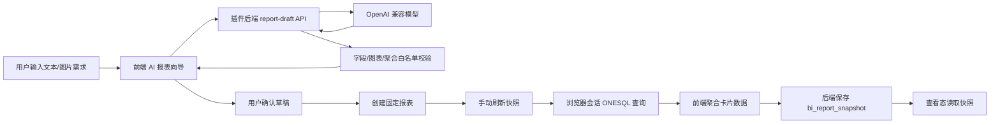

# ONES 固定报表中心技术实现方案

## 1. 技术目标

基于 ONES Open Platform 1.0 实现一个 `.opk` 插件，将现有 BI 仪表盘能力调整为固定报表中心：

- 前端提供报表列表、AI 生成报表、草稿确认、报表查看、编辑态布局和手动刷新快照。
- 后端提供报表配置、AI 配置、AI 草稿生成、草稿落库、快照读写等 API。
- 数据查询仍基于 ONES 当前用户会话与 ONESQL 能力，确保使用真实 ONES 数据。
- 查看态优先读取快照，避免每次打开报表都触发全量 ONESQL。

本方案严格限定在 Open Platform 1.0：

- 使用 `config/plugin.yaml`、`backend/`、`web/` 和 `.opk` 交付。
- 不使用 Open Platform 2.0 的 `.opkx`、Hosted API、Extensions 或 Web SDK。

## 2. 总体架构



## 3. 后端 API

### 3.1 AI 配置

```text
GET  /team/:teamUUID/bi/ai/config
POST /team/:teamUUID/bi/ai/config
```

配置项：

- `base_url`：OpenAI 兼容服务地址。
- `model`：模型名称。
- `supports_vision`：是否支持图片输入。
- `api_key`：仅写入，不明文返回。

GET 返回时只返回 `has_api_key: true/false`，不返回真实密钥。

### 3.2 AI 报表草稿

```text
POST /team/:teamUUID/bi/ai/report-draft
```

请求：

```ts
{
  prompt: string
  image?: {
    name?: string
    mime_type: string
    data_url: string
  }
}
```

返回：

```ts
{
  draft: ReportDraft
}
```

`ReportDraft` 结构：

```ts
type ReportDraft = {
  title: string
  description?: string
  data_scope?: Record<string, unknown>
  filters: Array<{
    field_key: string
    operator: string
    value: unknown
  }>
  cards: Array<{
    title: string
    chart_type: 'number' | 'bar' | 'pie' | 'donut' | 'table'
    metric: {
      name: string
      aggregation: 'count' | 'count_distinct'
      field_key: string
    }
    dimension?: {
      field_key: string
      name: string
    }
    limit?: number
    layout?: {
      x: number
      y: number
      w: number
      h: number
      grid_size: 48
    }
  }>
}
```

### 3.3 从草稿创建报表

```text
POST /team/:teamUUID/bi/report/from-draft
```

后端将草稿转换为现有 `bi_dashboard.cards_json` 结构，并在 `config_json` 中记录：

- `report_mode: "fixed"`
- `source: "ai_draft" | "manual"`
- `draft_json`
- `snapshot_policy: "manual"`

### 3.4 快照读写

```text
GET  /team/:teamUUID/bi/dashboard/:dashboardUUID/snapshots
POST /team/:teamUUID/bi/dashboard/:dashboardUUID/snapshots
```

POST 保存单张或多张卡片快照：

```ts
{
  snapshots: Array<{
    card_uuid: string
    status: 'success' | 'failed'
    data: unknown
    error?: string
  }>
}
```

GET 返回当前报表下每张卡片最近一次快照。

## 4. 实体存储设计

### 4.1 既有实体

保留既有实体，不删除、不修改已发布属性：

- `bi_dashboard`
- `bi_dataset`
- `bi_audit_log`

### 4.2 新增实体：`bi_app_config`

用于保存团队级插件配置。

```yaml
bi_app_config:
  config_key: text
  team_uuid: text
  config_json: text
  updated_by: text
  updated_at: integer
```

Key 建议：`team_${teamUUID}_ai`

### 4.3 新增实体：`bi_report_snapshot`

用于保存报表卡片快照。

```yaml
bi_report_snapshot:
  snapshot_uuid: text
  team_uuid: text
  dashboard_uuid: text
  card_uuid: text
  status: text
  data_json: text
  error: text
  created_by: text
  created_at: integer
```

Key 建议：`snap_${dashboardUUID}_${cardUUID}`

首期只保存每张卡片最近一次快照。历史快照和版本对比放到 P1/P2。

## 5. 字段与查询白名单

AI 和前端高级编辑都必须收敛到白名单字段：

```ts
const SUPPORTED_FIELDS = [
  'uuid',
  'title',
  'issue_type',
  'status',
  'assignee',
  'priority',
  'project_uuid',
  'created_at',
]
```

支持的筛选操作：

- `eq`
- `neq`
- `in`
- `not_in`
- `contains`
- `empty`
- `not_empty`

支持的聚合：

- `count`
- `count_distinct`

不支持 AI 直接输出 SQL、ONESQL 或 JavaScript 表达式。

## 6. 前端实现

### 6.1 报表列表

新增入口：

- `AI 生成报表`
- `AI 配置`

用户可以继续使用现有“新建报表/新建卡片”能力，但默认推荐通过 AI 草稿创建固定报表。

### 6.2 AI 生成报表 Modal

包含：

- 需求文本输入框。
- 图片上传。
- 生成草稿按钮。
- 草稿结果预览。
- 确认创建报表按钮。

如果 AI 未配置，则提示先配置 provider。

### 6.3 报表详情

查看态：

- 只展示卡片内容。
- 优先展示快照数据。
- 没有快照时展示“尚未刷新”。
- 不显示网格背景、拖拽控制、数据源、耗时、更新时间等调试信息。

编辑态：

- 显示 48px 网格。
- 支持拖拽位置和尺寸。
- 避免卡片互相覆盖。
- 保留高级编辑入口。

### 6.4 手动刷新快照

详情页新增“刷新快照”按钮。点击后：

1. 前端按卡片配置通过当前浏览器会话查询 ONESQL。
2. 前端完成聚合。
3. 前端调用快照 POST API 保存每张卡片的结果。
4. 页面重新读取快照并刷新展示。

首期不做后端定时刷新，避免后端管理员身份聚合导致权限和性能风险。

## 7. AI 调用实现

后端调用 OpenAI 兼容 `/chat/completions`：

- `base_url` 末尾自动兼容 `/v1`。
- 请求中使用系统提示词约束模型只返回 JSON。
- 文本输入使用 `type: "text"`。
- 图片输入使用 `type: "image_url"`，传入 data URL。
- 响应必须解析为 JSON，解析失败返回明确错误。
- 返回前执行字段、图表、聚合、布局校验和修正。

## 8. 版本计划

### 0.5.0

- 产品方向切换为固定报表中心。
- 新增 AI 配置、AI 草稿生成、草稿确认创建报表。
- 新增快照实体和快照 API。
- 查看态优先读快照。
- 新增手动刷新快照入口。

### 0.5.x

- 完善模板和草稿编辑。
- 优化快照刷新状态、错误展示和重试。
- 扩展图表类型。

### 0.6.x

- 定时刷新。
- 导出和订阅。
- 报表模板市场。
- 增量刷新和预聚合。

## 9. 风险与边界

- `api_key` 目前存储在插件实体中，首期不做加密能力承诺，前端不回显明文。
- 浏览器会话 ONESQL 依赖当前 ONES 页面登录态。
- 快照是刷新者当时可见数据的固化结果，权限策略需在客户验收前确认。
- 百万级数据量下，全量刷新仍可能耗时较长，后续必须通过增量刷新、定时任务和预聚合优化。
